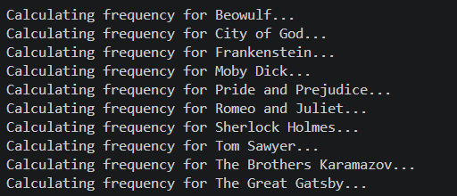
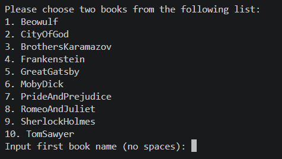
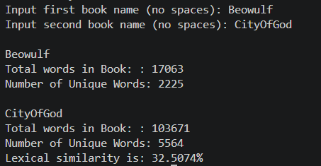

# Project Four 
Author: Grant Carmichael

This project is for CSCE 20104 at the University of Arkansas
## Purpose
The purpose of this project is to determine the lexical similarity between two books. This is done through two files, one handling the reading/writing of the frequency of words in a book file, while the other compares two files.

## Functionality

### Reading Data
The file given to the program is first stripped of all of the non-alphabetical values:

    while (file >> word)
    {
        string cleaned = "";

        // examine each character in the word, cleans         
        non-letter aspects of each word
        for (char c : word)
        {
            if (isalpha(c))
                cleaned += c;
        }

        // only store non-empty words
        if (!cleaned.empty())
            cleanedWords.push_back(cleaned);
    }

After being cleaned, all of the words are converted to lowercase:
```
for(const string word: cleanedWords)
    {
        string lowercase = "";
        
        // Converts all words to lowercase
        for(char c: word){
            lowercase += tolower(c);
        }

        if(!lowercase.empty())
            words.push_back(lowercase);
    }
```

### Handling Frequency
After reading the data and cleaning it, the values are pushed into a vector which is then passed to another function that handles calculating the frequency of each word.

```
vector<string> WordFrequency(const vector<string>& words)
{
    vector<string> frequency;
    int count = 0;
    cout << words.size() << endl;

    string freqWord;
    vector<string> frequentWords;
    ifstream file("FrequentWords.txt");

    while(file >> freqWord){
        frequentWords.push_back(freqWord);
    }
    
    sort(frequentWords.begin(), frequentWords.end()); // Sorts list alphabetically

    for(int i = 0; i < words.size(); i++){
        string word = words[i];
        int search = binarySearch(word, frequentWords, 0, 99);
        if(search){ // If search is true, go to next index, else keep going
            continue;
        }
        
        if(word == words[i+1]){
            //cout << "Same word: ";
            //cout << word << endl;
            count++;
        } else {
            if(count > 1){
                //cout << "Pushed back" << endl;
                frequency.push_back(word + ":" + to_string(count));
                word = words[i+1];
                count = 0;
            }
        }
    }
    return frequency;
}
```
This function uses a binary search algorithm that performs the removal of the 100 most common words in the english dictionary from the words in the file.

## Test Cases
Using the goo file initally to write all of the book frequencies to their respective text files, the user can then use the googoo file to compare the similarities of two of the books.

Upon running the goo file, the following text will be shown:



After the user has been shown this screen, moving to the googoo file will allow for lexical comparison to be performed:





## Conclusion
This was one of the most beneficial projects I completed during my data structures and algorithms class. I learned useful information for using linear and binary search algorithms in software, and the process for implementing those. 

I would like to eventually revist this program to allow the user to search any two books on the web and compare those two rather then only having a set number.


